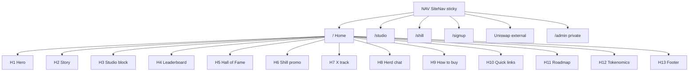

# Astro Bull — Labeled Site Map (edit guide)

Use this as your **map + file index**.  
When you say “change the buy button” or “edit Hall of Fame”, look up the **Ref** below.

**Live domain:** https://astrobull.xyz  
**Repo layout:** `src/routes` = pages · `src/components` = UI blocks · `src/lib` = data/logic

---

## 1. Pages (URL routes)

| Ref | URL | File | What it is |
|-----|-----|------|------------|
| **P0** | `/` | [`src/routes/index.tsx`](src/routes/index.tsx) | Home — stacked sections (see §2) |
| **P1** | `/studio` | [`src/routes/studio.tsx`](src/routes/studio.tsx) | Creator Studio page |
| **P2** | `/shill` | [`src/routes/shill.tsx`](src/routes/shill.tsx) | Shill HQ / pack generator |
| **P3** | `/signup` | [`src/routes/signup.tsx`](src/routes/signup.tsx) | Creator sign-up |
| **P4** | `/admin` | [`src/routes/admin.tsx`](src/routes/admin.tsx) | Private admin inbox (password) |
| **PRoot** | *(all pages)* | [`src/routes/__root.tsx`](src/routes/__root.tsx) | Shell: nav + scroll + global CSS |

---

## 2. Home page scroll order (top → bottom)

Edit order here: **`src/routes/index.tsx`**.

```
┌─────────────────────────────────────────────────────────────┐
│  NAV (sticky) — SiteNav                    Ref: NAV         │
├─────────────────────────────────────────────────────────────┤
│  ① HERO                                    Ref: H1          │
│     banner · video · buy/social/share · title/chapter       │
│  ② STORY                                   Ref: H2  #story  │
│  ③ CREATOR STUDIO (inline)                 Ref: H3  #studio │
│  ④ LEADERBOARD                             Ref: H4  #leaderboard │
│  ⑤ WALL / HALL OF FAME                     Ref: H5  #wall-of-fame │
│  ⑥ SHILL PROMO                             Ref: H6  #shill  │
│  ⑦ X TRACKER                               Ref: H7  #x-track │
│  ⑧ HERD CHAT                               Ref: H8  #herd-chat │
│  ⑨ HOW TO BUY                              Ref: H9  #buy    │
│  ⑩ QUICK LINKS + socials grid              Ref: H10 #quick  │
│  ⑪ ROADMAP                                 Ref: H11 #roadmap │
│  ⑫ TOKENOMICS + burns                      Ref: H12 #tokenomics │
│  ⑬ FOOTER (socials anchors)                Ref: H13 #socials │
└─────────────────────────────────────────────────────────────┘
```

### Home section detail

| Ref | Anchor (jump link) | Component file | Typical edits |
|-----|--------------------|----------------|---------------|
| **NAV** | — | [`SiteNav.tsx`](src/components/SiteNav.tsx) | Top bar: Buy, Studio, Explore menu, quick hops |
| **H1** | *(top)* | [`Hero.tsx`](src/components/Hero.tsx) | Hero video, sound/YouTube, buy/social grid, ASTRO BULL title |
| **H2** | `#story` | [`ChapterStory.tsx`](src/components/ChapterStory.tsx) | Story copy / chapter narrative |
| **H3** | `#studio` | [`CreatorStudio.tsx`](src/components/CreatorStudio.tsx) | Studio form, TG upload CTAs, creator signup UI |
| **H4** | `#leaderboard` | [`CreatorLeaderboard.tsx`](src/components/CreatorLeaderboard.tsx) | Rankings board |
| **H5** | `#wall-of-fame` | [`WallOfFame.tsx`](src/components/WallOfFame.tsx) + **data** [`wall-of-fame.ts`](src/lib/wall-of-fame.ts) | Hall of Fame cards — **add creators in the data file** |
| **H6** | `#shill` | [`ShillPromo.tsx`](src/components/ShillPromo.tsx) | Promo strip linking to Shill HQ |
| **H7** | `#x-track` | [`XAccountTracker.tsx`](src/components/XAccountTracker.tsx) | X / reply tracking UI |
| **H8** | `#herd-chat` | [`HerdChat.tsx`](src/components/HerdChat.tsx) | On-site chat |
| **H9** | `#buy` | [`HowToBuy.tsx`](src/components/HowToBuy.tsx) | MetaMask steps + Uniswap CTA |
| **H10** | `#quick` | [`QuickLinks.tsx`](src/components/QuickLinks.tsx) | Buy Uniswap + social grid |
| **H11** | `#roadmap` | [`ChapterRoadmap.tsx`](src/components/ChapterRoadmap.tsx) | Roadmap phases |
| **H12** | `#tokenomics` | [`ChapterTokenomics.tsx`](src/components/ChapterTokenomics.tsx) + [`LiveBurnCounter.tsx`](src/components/LiveBurnCounter.tsx) | Supply table, burns, Uniswap/chart |
| **H13** | `#socials` | [`Footer.tsx`](src/components/Footer.tsx) | Footer links + socials |

**Studio sub-anchors** (inside Creator Studio):

| Anchor | Purpose |
|--------|---------|
| `#creator-signup` | Sign-up block |
| `#studio-create-form` | Create form |
| `#studio-next-step` | Next-step guidance |

---

## 3. Top nav map (Ref: NAV)

File: [`src/components/SiteNav.tsx`](src/components/SiteNav.tsx)

| Control | Where it goes |
|---------|----------------|
| Logo **AstroBull** | `/` |
| Quick: Story / Board / Fame | `#story` · `#leaderboard` · `#wall-of-fame` |
| **Shill** | `/shill` |
| **Buy** (green) | Uniswap (external) — see §5 |
| **Studio** (red) | `/studio` |
| **Sign up** | `/signup` |
| **Explore** menu | Card grid of all major destinations |

---

## 4. Other pages (deep edit)

| Ref | Page | Main UI component | Logic / data |
|-----|------|-------------------|--------------|
| **P1** | Studio | [`CreatorStudio.tsx`](src/components/CreatorStudio.tsx) | [`signup.ts`](src/lib/signup.ts), [`supabase.ts`](src/lib/supabase.ts), [`community.ts`](src/lib/community.ts) |
| **P2** | Shill HQ | [`ShillTool.tsx`](src/components/ShillTool.tsx) | [`shiller-engine.ts`](src/lib/shiller-engine.ts) |
| **P3** | Sign up | (route + studio pieces) | [`signup.ts`](src/lib/signup.ts) |
| **P4** | Admin | route file | password env `VITE_ADMIN_PASSWORD` |

---

## 5. Critical links & constants (change carefully)

| What | Where to edit |
|------|----------------|
| **Uniswap buy URL** | [`src/lib/wallet.ts`](src/lib/wallet.ts) → `UNISWAP_SWAP` (also Hero, HowToBuy, QuickLinks, Tokenomics, SiteNav) |
| **Token contract** | Same places — `0x5987dbf316dcefb6d0d35ee8f6884a0a1f12cb03` |
| **DexScreener chart** | Hero, HowToBuy, QuickLinks, Tokenomics |
| **TG main + content upload** | [`src/lib/community.ts`](src/lib/community.ts) |
| **Hall of Fame creators** | [`src/lib/wall-of-fame.ts`](src/lib/wall-of-fame.ts) ← **easiest data edit** |
| **Leaderboard data** | [`src/lib/leaderboard.ts`](src/lib/leaderboard.ts) |
| **Burn / supply helpers** | [`src/lib/burn.ts`](src/lib/burn.ts) |
| **Hero video file** | `public/astro-bull-hero.mp4` + path in `Hero.tsx` |
| **Whitepaper PDF** | `public/astrobull-whitepaper.pdf` |
| **Global colors / fonts** | [`src/styles.css`](src/styles.css) |
| **Env keys (Vercel)** | `VITE_SUPABASE_URL`, `VITE_SUPABASE_ANON_KEY`, `VITE_ADMIN_PASSWORD`, `VITE_WEB3FORMS_ACCESS_KEY` |

---

## 6. Visual sitemap (pages)



---

## 7. “I want to change X” cheat sheet

| You want to… | Edit this |
|--------------|-----------|
| Top **Buy** button | `SiteNav.tsx` + `wallet.ts` `UNISWAP_SWAP` |
| Top **Studio** button | `SiteNav.tsx` (link) · studio UI in `CreatorStudio.tsx` |
| Explore menu cards | `SiteNav.tsx` → `DESTINATIONS` array |
| Hero video / sound / YouTube | `Hero.tsx` · video in `public/` |
| Hero social row | `Hero.tsx` |
| Story text | `ChapterStory.tsx` |
| Add a famous creator | `src/lib/wall-of-fame.ts` |
| Shill pack wording | `src/lib/shiller-engine.ts` · UI `ShillTool.tsx` |
| How-to-buy steps | `HowToBuy.tsx` |
| Tokenomics table | `ChapterTokenomics.tsx` |
| TG content upload link | `src/lib/community.ts` |
| Reorder home sections | `src/routes/index.tsx` |
| Site colors | `src/styles.css` |

---

## 8. Files on disk but **not** on live home right now

These exist but are **not** mounted in `index.tsx` (safe to ignore unless you re-enable):

- `ChapterOrigin.tsx` (`#origin`)
- `ChapterNFTs.tsx` (`#nfts`)
- `ChapterCreators.tsx` / `CreatorSection.tsx` (`#creators`)
- `ChapterCommunity.tsx` (`#community`)
- `NeonSign.tsx`, `PlatformPush.tsx`

---

## 9. How to talk about edits (copy this)

Examples you can send:

- “Edit **H1** — make the title smaller”
- “Update **H5** / wall-of-fame data — add creator @name”
- “Change **NAV** Buy to open chart instead”
- “Reorder home: put **H9 Buy** above **H3 Studio** in index.tsx”
- “Fix **P2** shill generator CTAs”

---

*Last aligned with repo structure for Astro Bull (TanStack Start + Vite).*
